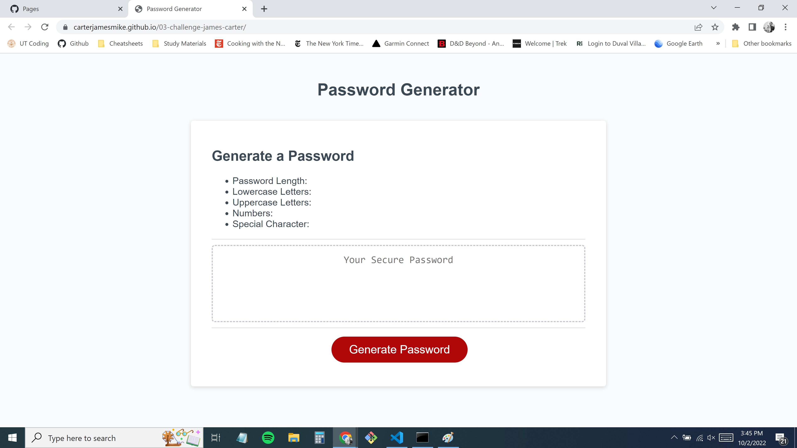

# 03-challenge-james-carter
This is the third challange assignment for the UTA Full Stack Coding Bootcamp. The unique acceptance criteria for this challenge was to create an application that randomly generates a password based off of the following user selected criteria from a series of prompts.
1. Password length between 8 and 128 characters
2. Options to include lower case characters, upper case characters, numerical characters, and special characters.
3. User prompt validation
4. Password is generated based off of user selection
5. Password is displayed on screen

## Access
-The deployed page can be accessed via https://carterjamesmike.github.io/03-challenge-james-carter/
-The code can be accessed via https://github.com/carterjamesmike/03-challenge-james-carter

## Screenshot of applicaiton

## Credits
N/A